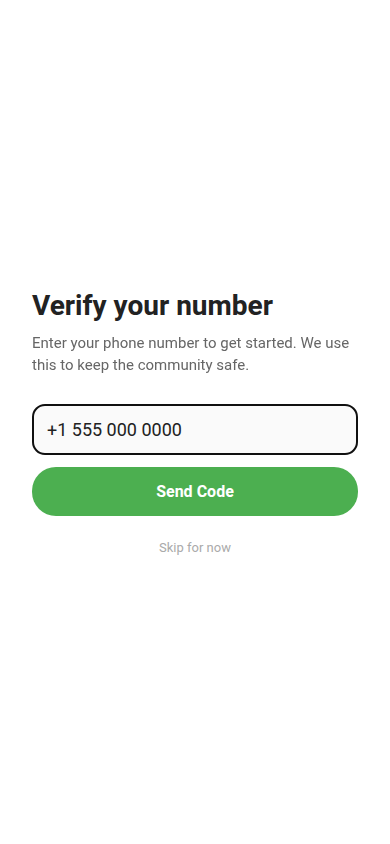
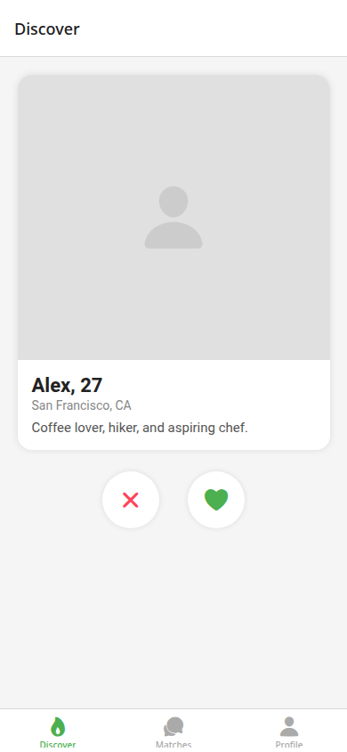
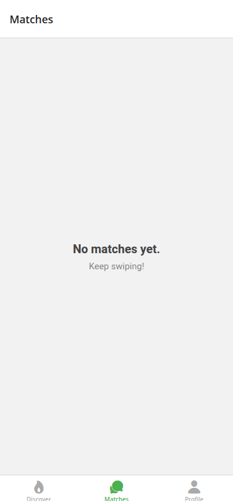
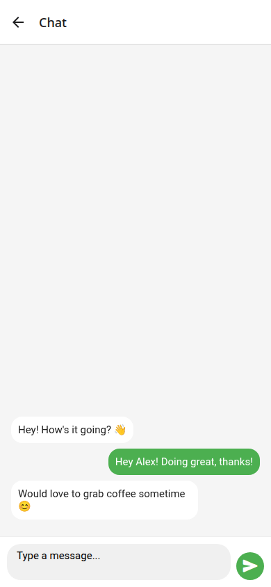
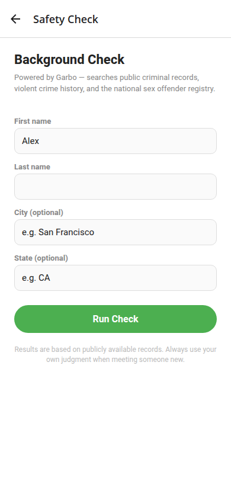
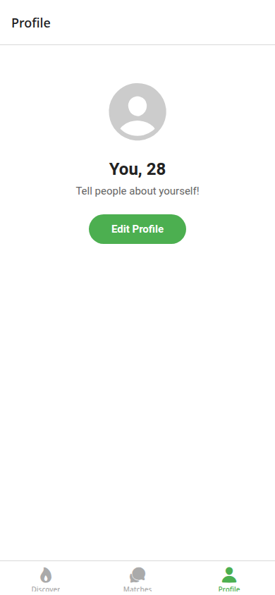

# safedate

A React Native dating app built with Expo. Browse profiles, match, and chat — with built-in safety features powered by Twilio and Garbo.

## Screenshots

| Phone Verify | Discover | Matches | Chat | Safety Check | Profile |
|---|---|---|---|---|---|
|  |  |  |  |  |  |

## Features

- **Phone Verification** — SMS OTP via Twilio Verify on first launch
- **Discover** — Swipe through profile cards with like and pass actions
- **Matches** — See everyone you've matched with at a glance
- **Chat** — Message your matches in a real-time-style thread
- **Safety Check** — Run a Garbo background check on any match (sex offender registry, violent crime history, public records)
- **Profile** — Edit your name, age, and bio

## Tech stack

- [Expo](https://expo.dev) ~56
- [React Native](https://reactnative.dev) 0.85
- [React Navigation](https://reactnavigation.org) — bottom tabs + native stack
- [Zustand](https://zustand-demo.pmnd.rs) — global state
- [Twilio Verify](https://twilio.com/verify) — phone number verification
- [Garbo](https://garbo.io) — background checks for dating safety
- TypeScript

## Safety setup

Copy `server/.env.example` to `server/.env` and add your keys:

| Key | Where to get it |
|---|---|
| `TWILIO_ACCOUNT_SID` / `TWILIO_AUTH_TOKEN` | [console.twilio.com](https://console.twilio.com) |
| `TWILIO_VERIFY_SERVICE_SID` | Create a Verify service in the Twilio console |
| `GARBO_API_KEY` | Apply at [garbo.io/for-platforms](https://garbo.io/for-platforms) |

Start the backend alongside the app:

```bash
cd server && npm install && npm start
```

## Getting started

```bash
npm install
npm start        # opens Expo Go QR code
npm run android
npm run ios
npm run web
```

Scan the QR code with the [Expo Go](https://expo.dev/go) app on your phone, or press `w` to open in the browser.

## Project structure

```
src/
├── screens/     # One file per screen
├── store/       # Zustand store (profiles, matches, messages)
├── types/       # Shared TypeScript types + nav param lists
└── data/        # Mock seed profiles
App.tsx          # Navigation root (Stack + Tab)
```
